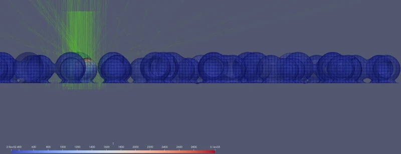

# meltPoolFoam

OpenFOAM solver for numerical simulation of metal laser melting. The solver targets processes where a focused laser beam initiates metal melting and subsequent material redistribution, such as Selective Laser Melting, laser polishing, and related processes.


<p align="center">
  
</p>

## Build and run

The solver supports OpenFOAM-v2406.

To build an augmented Docker image run
```bash
    docker build -f Dockerfile.release -t my_openfoam-plus .
```
>[!NOTE]
> For macOS users check note about creation of case-sensitive volume in the end of the README file.

The new image can be used within an intermediate container as
```bash
    docker run -it --rm -u="$(id -u):$(id -g)" -v="$(pwd):/home/openfoam" my_openfoam-plus
```

To build solver run
```bash
./Allwmake
```

## Test cases

| Case | Description |
| --- | --- |
| `Stefan1D` | 1D Stefan phase-change problem [[Panov et al., 2025]](https://doi.org/10.1063/5.0292764)|
| `horizontalSolidification2D` | 2D horizontal solidification shrinkage [[Panov et al., 2025]](https://doi.org/10.1063/5.0292764)|
| `verticalSolidification2D` | 2D vertical solidification shrinkage [[Panov et al., 2025]](https://doi.org/10.1063/5.0292764)|
| `singleTrackPrinting` | 3D laser scan over a powder bed with adaptive moving frame and mesh refinement |
| `singleTrackMeltingReferenceFrame` | 3D laser scan in the thermo-capillary regime, moving reference frame |
| `Cunningham2019` | 3D keyhole melt-pool reference case  [[Cunningham et al., 2019]](https://www.science.org/doi/10.1126/science.aav4687)|

Each case has its own `Allrun` / `Allclean`. To run one:

```bash
cd run/singleTrackPrinting
./Allrun
```

## Development environment

The repository ships a VS Code developer container with OpenFOAM-v2406 and `ccls` preconfigured, based on [openfoam-dev-ccls-vscode](https://github.com/Mygetsy/openfoam-dev-ccls-vscode). Open the folder in VS Code and choose **Reopen in Container**.

### macOS — case-sensitive volume required

APFS is case-insensitive by default and breaks OpenFOAM. Create a case-sensitive volume before cloning:

```bash
sudo curl -o /usr/local/bin/openfoam-macos-file-system \
    http://dl.openfoam.org/docker/openfoam-macos-file-system
sudo chmod 755 /usr/local/bin/openfoam-macos-file-system
sudo openfoam-macos-file-system -v my_openfoam create
mkdir -p my_openfoam
sudo openfoam-macos-file-system -v my_openfoam mount
```

Then clone the repo into the mounted volume.

## Citation

If you use meltPoolFoam in academic work, cite:

> D. V. Panov, O. A. Rogozin, O. V. Vasilyev, "The influence of volumetric shrinkage on the metal solidification process under localized energy deposition", *Physics of Fluids* **37** (10) (Oct. 2025). [doi:10.1063/5.0292764](https://doi.org/10.1063/5.0292764)

## License

GPL v3 — see [LICENSE](LICENSE).
